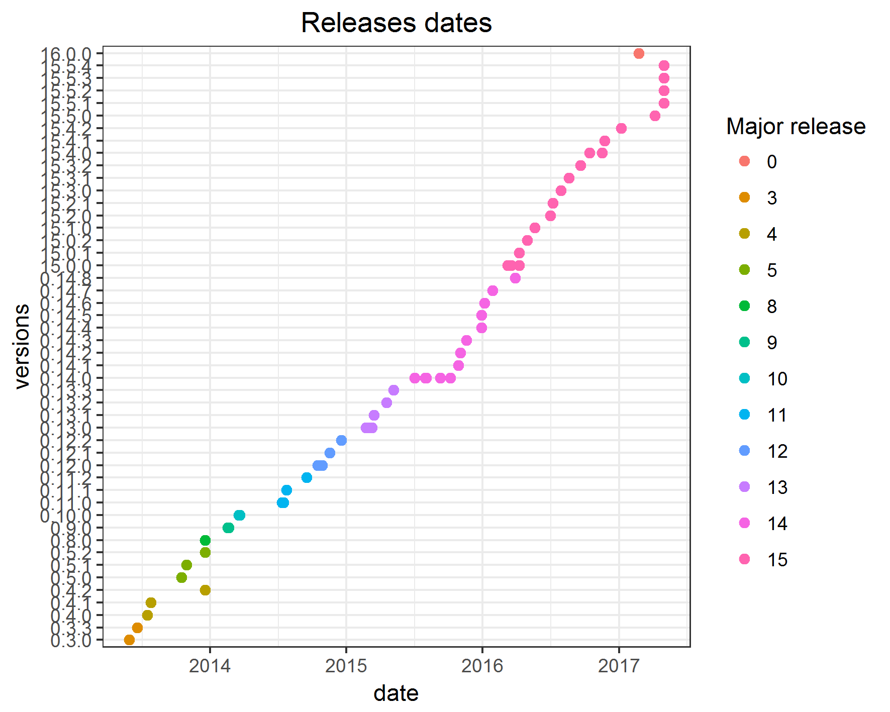
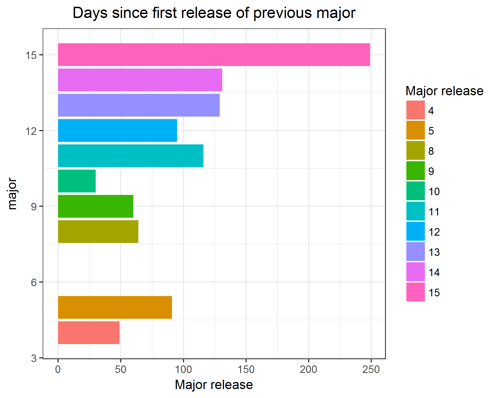
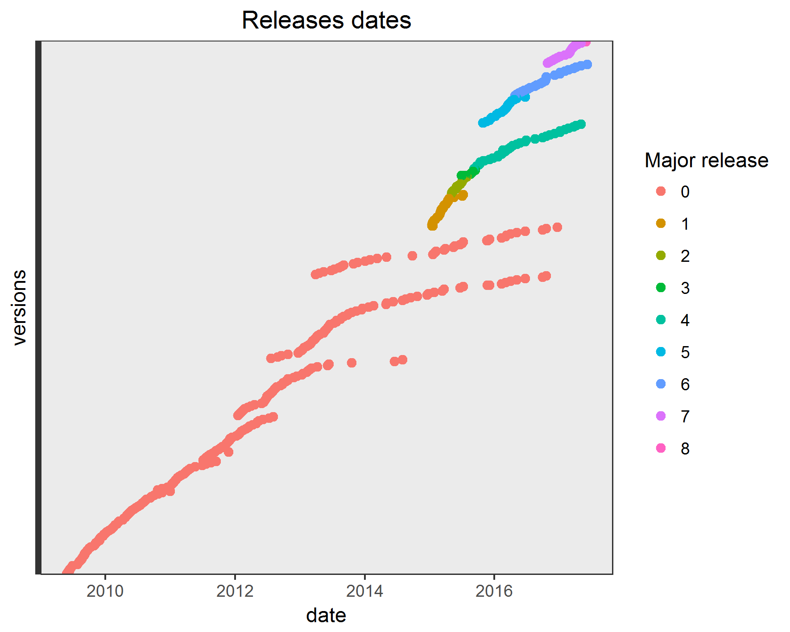
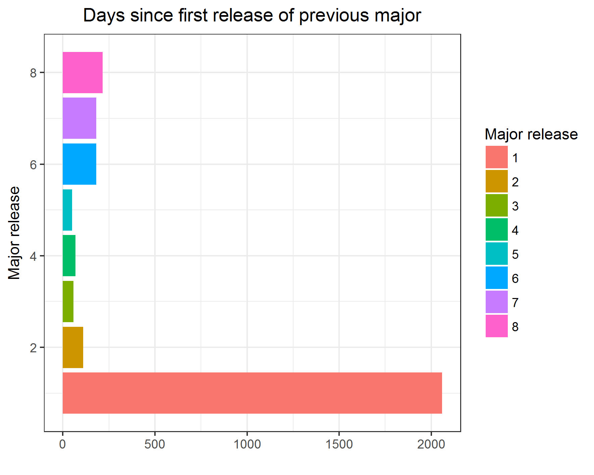

# JS ecosystem

> as for 05.05.2017

> still work in progress

> main todos at the end

## Introduction

The influential post [How it feels to learn JavaScript in 2016](https://hackernoon.com/how-it-feels-to-learn-javascript-in-2016-d3a717dd577f "How it feels to learn JavaScript in 2016
") highlighted important feature of JavaScript - a vast amount of JavaScript frameworks avaiable for developers.
But feelings are not enough to describe the whole ecosystem and we need some data. Some of them were collected by [the State of JavaScript Survey](http://stateofjs.com/ "The State of Javascript") where we can find answers to questions on topics ranging from front-end frameworks and state management, to build tools and testing libraries.
For those who are starting with web-development I would recommend to read [A Study Plan To Cure JavaScript Fatigue](https://medium.freecodecamp.com/a-study-plan-to-cure-javascript-fatigue-8ad3a54f2eb1). 

My personal goal here is to analyse the most popular frameworks to highlight another troublesome feature of JavaScript. There is not only vast amount of the frameworks, but also the vast amount of versions of each framework. It is hard for the beginner to study particular framework based on the materials and courses avaiable online,
<!--add some link-->
bacause there are becoming outdated very quickly. Even though that for most of them principles are not changing some features are appearing/disappearing often. But not only frameworks are changing. All existing JavaScript labels can give you a headache. The first encouter of ES5, ES6 and ES2016 can be frightening, and the advice that you can learn babel to resolve the problem is not helping. For those who are not familiar with them - here you have nice blog post about [JavaScript versioning](https://benmccormick.org/2015/09/14/es5-es6-es2016-es-next-whats-going-on-with-javascript-versioning/).

Based on github repos and npm stats I will check how often new version of each framework is released with emphasis on the major releases. Based on the [the State of JavaScript Survey](http://stateofjs.com/ "The State of Javascript") I will focus on the following frameworks:

* Front-End [survey](http://stateofjs.com/2016/frontend/ "Survey Results")
    * React :white_check_mark:
    * Angular :white_check_mark:
    * Ember :white_check_mark:
    * Vue :white_check_mark:
    * Backbone :white_check_mark:
* State Management [survey](http://stateofjs.com/2016/statemanagement/)
    * Redux :white_check_mark:
    * Mobx
    * Relay
* Full- Stack [survey](http://stateofjs.com/2016/fullstack/)
    * Meteor :white_check_mark:
    * FeathersJS
    * DoneJS
* Build Tools [survey](http://stateofjs.com/2016/buildtools/)
    * Webpack :white_check_mark:
    * Grunt
    * Gulp
    * Browserify
* Node.js :white_check_mark:

The analysis is done with [R](https://www.r-project.org/) and presented using [GitHub Pages](https://pages.github.com/). All codes are available on GitHub
<!--add repo link -->

## JS frameworks

As for now the data about folowing frameworks was downloaded.

|owner     |name     |date_min   |version_first |date_max   |version_last |
|:---------|:--------|:----------|:------------:|:----------|:-----------:|
|angular   |angular  |2015-03-14 |0.0.1         |2017-06-01 |4.2.0        |
|jashkenas |backbone |2010-10-13 |0.1.0         |2016-04-05 |1.3.3        |
|webpack   |webpack  |2013-12-19 |1.0.0         |2017-06-07 |3.0.0        |
|nodejs    |node     |2009-05-27 |0.0.1         |2017-06-06 |8.0.0        |
|meteor    |meteor   |2011-12-10 |0.0.40        |2017-06-06 |1.6          |
|emberjs   |ember.js |2011-06-18 |0.9           |2017-05-31 |2.14.0       |
|facebook  |react    |2013-07-02 |0.3.0         |2017-05-01 |15.5.4       |
|vuejs     |vue      |2013-12-07 |0.6.0         |2017-05-09 |2.3.3        |
|reactjs   |redux    |2015-06-02 |0.2.0         |2016-09-04 |3.6.0        |

Some frameworks use only numeric versioning, while other use also extended tags (e.g. rc1, rc2, etc. - see [versioning](#Versioning)).

Some data was downloaded using [GitHub GraphQL api](https://developer.github.com/v4/), some using webscrapping techniques. For more details see R codes.

### React
Facebook with its [react repo](https://github.com/facebook/react) is using mainly number versioning.  After version v0.14.8 facebook change the versioning and started with the version v15.0.0. See tables below:

Last 10 releases:

|owner    |name  |date       |version |version_ext |
|:--------|:-----|:----------|:-------|:-----------|
|facebook |react |2017-05-01 |v15.5.1 |15.5.1      |
|facebook |react |2017-05-01 |v15.5.2 |15.5.2      |
|facebook |react |2017-05-01 |v15.5.3 |15.5.3      |
|facebook |react |2017-05-01 |v15.5.4 |15.5.4      |
|facebook |react |2017-04-07 |v15.5.0 |15.5.0      |
|facebook |react |2017-01-06 |v15.4.2 |15.4.2      |
|facebook |react |2016-11-23 |v15.4.1 |15.4.1      |
|facebook |react |2016-11-16 |v15.4.0 |15.4.0      |
|facebook |react |2016-09-19 |v15.3.2 |15.3.2      |
|facebook |react |2016-08-19 |v15.3.1 |15.3.1      |

Major versions:

|owner    |name  | major|  N|date_first |date_last  |previous   |since_release |since_previous |
|:--------|:-----|-----:|--:|:----------|:----------|:----------|:-------------|:--------------|
|facebook |react |    15| 20|2016-03-08 |2017-05-01 |2015-07-03 |419 days      |249 days       |
|facebook |react |    14| 13|2015-07-03 |2016-03-29 |2015-02-22 |270 days      |131 days       |
|facebook |react |    13|  6|2015-02-22 |2015-05-08 |2014-10-16 |75 days       |129 days       |
|facebook |react |    12|  4|2014-10-16 |2014-12-18 |2014-07-13 |63 days       |95 days        |
|facebook |react |    11|  4|2014-07-13 |2014-09-16 |2014-03-19 |65 days       |116 days       |
|facebook |react |    10|  2|2014-03-19 |2014-03-21 |2014-02-17 |2 days        |30 days        |
|facebook |react |     9|  2|2014-02-17 |2014-02-20 |2013-12-19 |3 days        |60 days        |
|facebook |react |     8|  1|2013-12-19 |2013-12-19 |2013-10-16 |0 days        |64 days        |
|facebook |react |     5|  3|2013-10-16 |2013-12-18 |2013-07-17 |63 days       |91 days        |
|facebook |react |     4|  3|2013-07-17 |2013-12-18 |2013-05-29 |154 days      |49 days        |
|facebook |react |     3|  2|2013-05-29 |2013-06-20 |NA         |22 days       |NA             |

### Node

Nodejs with its [node repo](https://github.com/nodejs/node/) is using number versioning, however they are releasing so often that in description you have details about each release. Maybe in the future I will extend the analysis with those details.

Last 10 releases:

|owner  |name |date       |version |version_ext |
|:------|:----|:----------|:-------|:-----------|
|nodejs |node |2017-06-06 |v6.11.0 |6.11.0      |
|nodejs |node |2017-05-30 |v8.0.0  |8.0.0       |
|nodejs |node |2017-05-03 |v7.10.0 |7.10.0      |
|nodejs |node |2017-05-02 |v6.10.3 |6.10.3      |
|nodejs |node |2017-05-02 |v4.8.3  |4.8.3       |
|nodejs |node |2017-04-11 |v7.9.0  |7.9.0       |
|nodejs |node |2017-04-04 |v4.8.2  |4.8.2       |
|nodejs |node |2017-04-04 |v6.10.2 |6.10.2      |
|nodejs |node |2017-03-29 |v7.8.0  |7.8.0       |
|nodejs |node |2017-03-21 |v7.7.4  |7.7.4       |

[Interactive version](https://plot.ly/~m.ziembinski/1/)

## Appendix

### Something about JS

* [Overview of the JavaScript ecosystem](https://medium.com/@bojzi/overview-of-the-javascript-ecosystem-8ec4a0b7a7be)

### Other useful links if you want to know how Internet is working

* [npm statistics](https://npm-stat.com/)
* [Find out what websites are Built With](https://builtwith.com/ "Built With")
* [Libscore - stats on JavaScript library usage](http://libscore.com/)
* [the State of JavaScript Survey](http://stateofjs.com/ "The State of Javascript")

### Versioning

I won't go into details of the details of a software release life cycle, as they can be easily check, e.g on [Wikipedia](https://en.wikipedia.org/wiki/Software_release_life_cycle). Here you can find meanings of the most common abbreviations:

* GA - General availability (a release); should be very stable and feature complete
* RC - Release candidate; probably feature complete and should be pretty stable - problems should be relatively rare and minor, but worth reporting to try to get them fixed for release.
* M - Milestone build - probably not feature complete; should be vaguely stable (i.e. it's more than just a nightly snapshot) but may still have problems.
* LTS - Long-term support; a type of special versions or editions of software designed to be supported for a longer than normal period.

### Awesome GraphQL

* [awesome-graphql](https://github.com/chentsulin/awesome-graphql)
* [APIs-guru](https://github.com/APIs-guru/graphql-apis)

### To Do

* interactive version of charts (plot.ly at the begining, d3 eventually)
* github pages webpage to present data
* why release dates are different in graphql database and tags web?
> diff between releases and tags. React data suggest that tag dates are better (see react ver. 0.10-0.12). 
* download other libriaries
